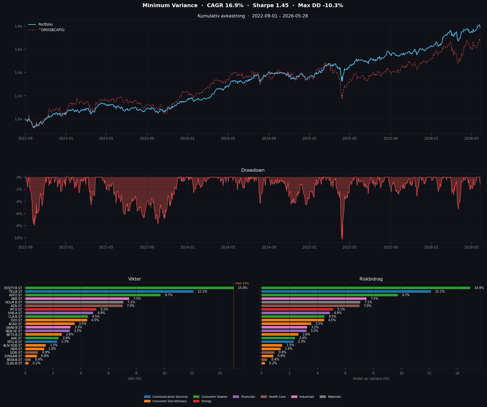

# portfolio.py - Portfolio Optimizer

Optimerar en portfölj med tre strategier: **MinVol** (default), **Risk Parity** eller **CAPM**.

## Användning

```bash
python portfolio.py                          # MinVol (default)
python portfolio.py --strategy riskparity    # Risk Parity
python portfolio.py --strategy capm          # CAPM (akademisk)
python portfolio.py --max-weight 0.15        # Annan maxvikt
python portfolio.py --portfolio mylist.csv   # Annan portföljfil
python portfolio.py --years 5                # 5 års historik
python portfolio.py --sector Financials      # Filtrera på sektor
python portfolio.py --min-weight 0.02        # Droppa positioner < 2% och kör om
```

**Input:** `portfolio.csv` (kolumn `Symbol`)
**Output:** `portfolio_minvol.txt` / `portfolio_riskparity.txt` / `portfolio_capm.txt` (+ motsvarande `.csv` och `.png` med 4-panels-chart)

## Strategier

| Strategi | Mål | Använder μ | Praktisk nytta |
|----------|-----|------------|----------------|
| `minvol` | Minimera varians | Nej | Hög - kovarians är förutsägbar |
| `riskparity` | Lika riskbidrag per tillgång | Nej | Hög - robust, alltid diversifierad |
| `capm` | Maximera Sharpe | Ja (CAPM) | Låg - teoretisk/akademisk |

**Rekommendation:** `minvol` för lägst risk, `riskparity` för bred diversifiering. CAPM finns för jämförelse/utbildning.

## Konfiguration

| Parameter | Default | Beskrivning |
|-----------|---------|-------------|
| `--strategy` | minvol | `minvol`, `riskparity` eller `capm` |
| `--portfolio` | portfolio.csv | Input-fil med aktier |
| `--max-weight` | 0.15 (minvol) / 1.0 (riskparity) / 0.60 (capm) | Max vikt per aktie |
| `--min-weight` | 0.0 | Droppa positioner under tröskeln och kör om optimeraren på subsetet (så `max_weight` håller utan renormalisering) |
| `--years` | 5 | Analysperiod |
| `--sector` | None | Filtrera på sektor (t.ex. `Financials`) |
| `--rf` | 0.02 | Årlig riskfri ränta (används av CAPM/Sharpe) |
| `--benchmark` | ^OMXSBCAPGI | Benchmarkticker för beta och jämförelse |

## MinVol - Minimum Variance

Minimerar portföljens varians utan att ta hänsyn till förväntad avkastning.

```
Minimera:   wᵀ Σ w          (portföljvarians)
Villkor:    Σ wᵢ = 1, 0 ≤ wᵢ ≤ MAX_WEIGHT
```

**Fördelar:**
- Kovariansmatrisen är relativt stabil och förutsägbar
- Kräver inga gissningar om framtida avkastning
- Låg-volatilitets-anomalin ger ofta bra riskjusterad avkastning

**Begränsningar:**
- Tenderar att koncentrera till defensiva aktier (telecom, utilities)
- Historisk volatilitet ≠ framtida volatilitet

## Risk Parity

Varje tillgång bidrar lika mycket till portföljens totala risk. Implementerad via Spinu (2013) konvex formulering.

```
Minimera:   0.5 yᵀΣy - (1/N) Σ ln(yᵢ)      (konvex, log-barriär)
Vikter:     wᵢ = yᵢ / Σyᵢ                    (normalisering)
```

**Fördelar:**
- Alltid diversifierad — alla tillgångar ingår
- Kräver inga avkastningsestimat
- Lågvolatila aktier får automatiskt högre vikt
- Robust — konvex optimering, konvergerar alltid (L-BFGS-B)

**Begränsningar:**
- Kan inte koncentrera som MinVol — ger aldrig lägst möjliga volatilitet
- Störst fördel vid blandade tillgångsklasser (aktier + räntor + råvaror)
- Inom en ren aktieportfölj av liknande tillgångar närmar sig vikterna equal weight

**MinVol vs Risk Parity (OMXS30, 3 år backtest):**
- MinVol: lägre vol (11.0% vs 12.8%), bättre Sharpe (1.22 vs 1.16), koncentrerad (16 aktier)
- Risk Parity: högre avkastning (17.6% vs 16.3%), bredare diversifiering (alla 30 aktier)

## CAPM - Capital Asset Pricing Model

Maximerar Sharpe-kvoten baserat på CAPM:s förväntade avkastning.

```
E(r) = rf + β(rm - rf)

Maximera:   (wᵀμ - rf) / √(wᵀΣw)    (Sharpe ratio)
```

**Problem med CAPM:**
- β förutspår inte avkastning särskilt väl empiriskt
- Marknaden är inte effektiv
- Historisk β är instabil över tid

## Output-mått

| Mått | Beskrivning |
|------|-------------|
| Historical Return | Backtest CAGR på träningsdata |
| Historical Vol | Realiserad volatilitet |
| Ex-Ante Vol | Teoretisk volatilitet från kovariansmatrisen |
| Sharpe Ratio | (Return - Rf) / Vol |
| Max Drawdown | Största toppfall |
| VaR/CVaR 95% | Daglig Value-at-Risk |

## Implementation

- Kovariansmatris: Ledoit-Wolf shrinkage (om sklearn finns)
- Optimering: SLSQP för MinVol/CAPM, L-BFGS-B för Risk Parity (Spinu 2013)
- Fallback: Likaviktad portfölj om optimering misslyckas

## PNG-chart



4-panels-visualisering (matplotlib krävs):

1. **Kumulativ avkastning** — portfölj vs benchmark över träningsperioden
2. **Drawdown** — löpande drawdown-kurva
3. **Vikter** — horisontell stapel per tillgång, färgad per sektor
4. **Riskbidrag** — varje tillgångs andel av portföljens totala volatilitet. Skiljer sig från vikter: en liten position i en högvolatil aktie kan stå för en stor del av risken. Bra sanity-check: om en enda aktie dominerar stapeln är portföljen koncentrerad i risktermer även om vikterna ser jämna ut.


